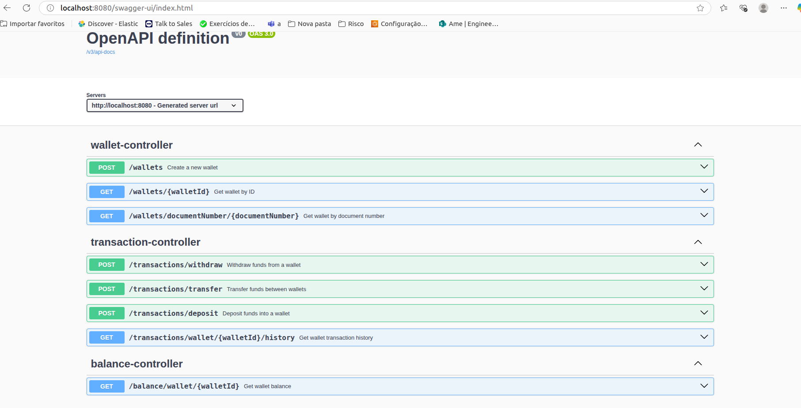
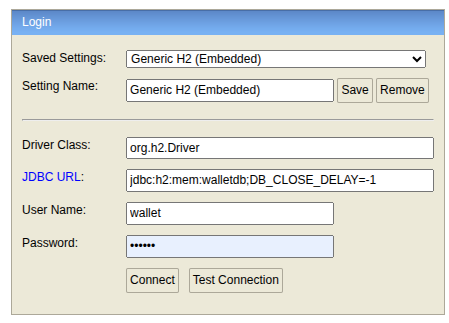

# Wallet Service

A RESTful API for managing user wallets, balances, and transactions.  
Built with **Java 17+, Spring Boot, H2, Spring Data JPA, Lombok, and Springdoc OpenAPI**.

---

## Features

- **Wallet Management:** Create and retrieve wallets by ID or document number
- **Balance Inquiry:** Get current wallet balance
- **Transactions:** Deposit, withdraw, transfer funds, and retrieve transaction history (with date filter)

---


##                                  Endpoints Overview

## Tech Stack

- Java 21+
- Spring Boot 3.2.5
- Spring Data JPA
- Lombok
- Gradle
- Springdoc OpenAPI (Swagger UI)
- Acesso ao Swagger:  http://localhost:8080/swagger-ui/index.html




- JUnit 5 & Mockito
- H2 (in-memory database)
- Acesso ao H2 : http://localhost:8080/h2/login.jsp
- User Name: wallet
- Password:  wallet





---

## Requirements

- Java 21 or later
- Gradle 7.6+ (wrapper included, no install needed)
- Internet connection (for dependency download)

---
## Installation


1. Execute through the terminal
```sh
git clone git@github.com:hetoryferreira/wallet.git
cd seu-repo-wallet
./gradlew clean build

./gradlew bootRun


